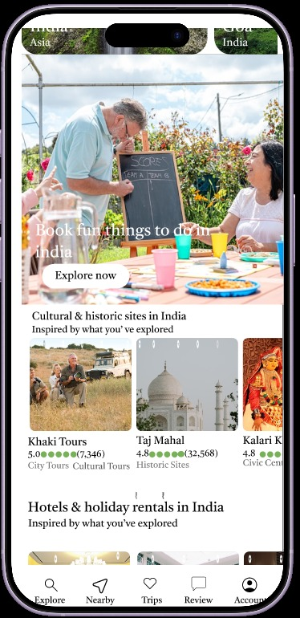
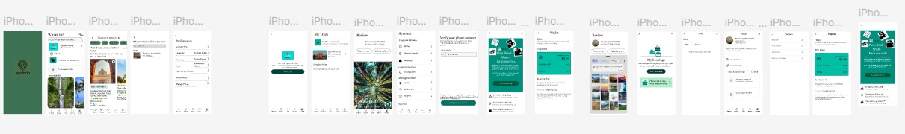

# 🎨 Figma UI/UX Design Project

## 📌 About the Project

This project was designed using Figma with a focus on creating
a modern, creative, and user-friendly interface.

## 🛠️ Tools Used

- Figma
- UI/UX Design
- Wireframing
- Prototyping
- Visual Design

## ✨ Design Screens

### Home Screen

### Explore Screen

### Main_feature Screen

## 🔗 Figma Prototype

[View Full Figma Design](https://www.figma.com/proto/qUh4A1v1gQZ2rUgUcVK5mu/EEL---2-Project?node-id=81-164&p=f&t=Xk8RGfs8VbiZfICf-1&scaling=scale-down&content-scaling=fixed&page-id=0%3A1&starting-point-node-id=81%3A164)

## 👩‍💻 My Contribution

- Designed the user interface
- Created layouts and components
- Worked on colors and typography
- Created an interactive prototype
- Focused on user-friendly design

## 🎯 Learning Outcome

Through this project, I improved my UI/UX design,
creativity, visual communication, and prototyping skills.
